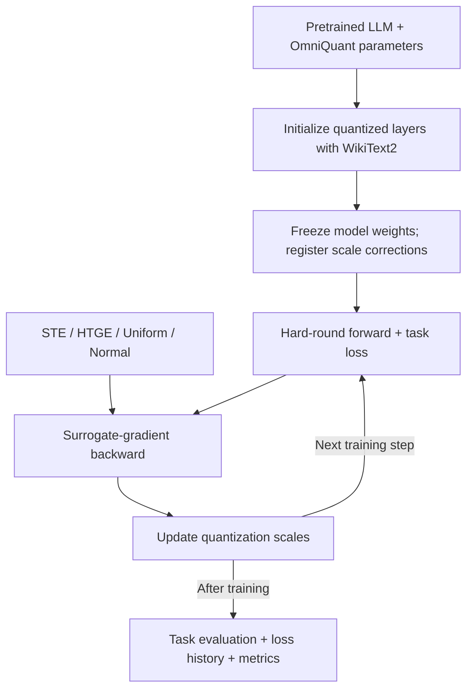

# ZOE-Grad: Boundary-Aware Surrogate Gradients for LLM Quantization

[English](README.md) | [中文](README_zh.md)

**NeurIPS 2026 · Accepted**

> **Rethinking Gradient Approximation in Quantization: A Zeroth-Order Expectation Perspective**

ZOE-Grad connects zeroth-order gradient expectations with boundary-aware surrogate gradients for low-bit LLM quantization. This repository implements the resulting gradients as PyTorch backward operators and provides a unified pipeline for **quantization-scale fine-tuning with frozen model weights**, across OPT, Llama-2, and Qwen3.

**Selected paper result:** on Qwen3-8B with W4A16 quantization, Uniform improves SQuAD F1 from **56.88 to 70.29 (+13.41 points)** over STE.

[Method](#method-overview) · [Results](#selected-results) · [Supported configurations](#supported-models-tasks-and-estimators) · [Quick start](#quick-start) · [Code guide](#code-guide) · [Detailed usage](#run)

## Why ZOE-Grad?

Rounding makes low-bit quantization difficult to optimize: its derivative is zero almost everywhere. The straight-through estimator (STE) substitutes a constant backward gradient, ignoring where an input lies relative to a quantization boundary.

ZOE-Grad derives surrogate gradients from the expectation of zeroth-order estimators. The perturbation distribution determines how the backward gradient responds to nearby quantization boundaries, giving a principled way to design and compare surrogates. The paper also explains STE as the expectation induced by fixed-magnitude Rademacher perturbations.

## Highlights

- **From theory to training operators.** A bidirectional construction connects perturbation distributions and boundary-dependent surrogate gradients; the repository implements STE, HTGE, Uniform, and Normal in [`quantize/quantizer.py`](quantize/quantizer.py).
- **Custom PyTorch backward.** The forward pass retains hard rounding; the backward pass applies the chosen analytic surrogate. Uniform and Normal support single-boundary and multiple-boundary formulations.
- **Quantization-scale optimization.** Starting from OmniQuant parameters, downstream supervision updates the scale corrections (`descale`) while keeping model weights frozen. The effective scale is `scale + descale`.
- **LLM training and evaluation.** Architecture-specific quantized layers support OPT, Llama-2, and Qwen3, including Qwen3 attention integration. Classification and question answering use task-specific losses and metrics.
- **Experiment orchestration and inspectable outputs.** A shared model/task/method interface supports a 5 × 8 × 4 configuration matrix, dry runs, seeded sampling, loss histories, loss curves, and metric JSON files.

## Selected Results

The following are **selected results reported in Table 1 of the paper**, comparing Uniform with STE under W4A16 quantization. W4A16 denotes 4-bit weights and 16-bit activations.

| Model | Task / metric | STE | Uniform | Absolute gain |
| --- | --- | ---: | ---: | ---: |
| Qwen3-8B | SQuAD F1 | 56.88 | **70.29** | **+13.41 points** |
| Qwen3-8B | RTE accuracy (%) | 83.39 | **88.81** | **+5.42 percentage points** |
| Llama-2-7B | SQuAD F1 | 47.33 | **66.69** | **+19.36 points** |

These examples illustrate gains across model architectures and both classification and generation. The best estimator depends on the model and task; the table is a selection of paper results rather than an average over all tasks or a new reproduction run.

**Additional paper experiments.** The paper also evaluates Llama-2-7B at W3A16, OPT-6.7B at W2A16, and Qwen2.5-0.5B at W4A4KV4 with and without rotation. In the rotation setting, RoUniform achieves **23.28** average ROUGE versus **21.15** for RoSTE (**+2.13 points**, Table 4). Qwen2.5 and rotation experiments are paper results; the current unified scripts cover the five models listed below.

## Method Overview

Each run loads a pretrained LLM, uses WikiText2 calibration inputs and external OmniQuant parameters to initialize quantized layers, then fine-tunes the quantization scales on a downstream task.



The zeroth-order expectation supplies the **analytic backward formula**. Training uses autograd and Hugging Face Trainer. The surrogate is evaluated during backpropagation and adds no surrogate computation to inference.

The implementation uses PyTorch fake quantization and floating-point linear operations to study quantization optimization; it does not provide a packed INT4 inference kernel.

## Supported Models, Tasks, and Estimators

| Component | Current unified-script support |
| --- | --- |
| Models | OPT-1.3B, OPT-6.7B, Llama-2-7B, Llama-2-13B, Qwen3-8B |
| Classification tasks | SST2 (SST-2), RTE, CB, BoolQ, WSC, WIC (WiC), MultiRC |
| Generative task | SQuAD |
| Gradient estimators | STE, HTGE, Uniform, Normal |
| Default quantization | W4A16, initialized from external OmniQuant parameters |
| Trainable parameters | Quantization-scale corrections (`descale`); model weights remain frozen |
| Calibration data | WikiText2 |
| Main libraries | Python, PyTorch, Transformers, Accelerate, datasets, Matplotlib |

Each of the five model aliases can be paired with any of the eight tasks and four estimators. The **160 combinations describe configurations supported by the scripts**, rather than a claim that all combinations have been reproduced in this repository.

## Code Guide

| Start here | What to inspect |
| --- | --- |
| [`quantize/quantizer.py`](quantize/quantizer.py) | Hard-round forward, custom surrogate backward, and effective quantization scales |
| [`train_main.py`](train_main.py) | Parameter freezing, task training, evaluation, and metric output |
| [`quantize/omniquant.py`](quantize/omniquant.py) | OmniQuant initialization and architecture-specific quantized-layer construction |
| [`models/int_qwen3_layer.py`](models/int_qwen3_layer.py) | Qwen3 attention and MLP integration, including Q/K normalization, RoPE, and KV cache handling |
| [`scripts/run.sh`](scripts/run.sh) / [`scripts/run_matrix.sh`](scripts/run_matrix.sh) | Single-experiment configuration and sequential matrix execution |

Supporting modules include [`tasks.py`](tasks.py) and [`templates.py`](templates.py) for task data and prompts, [`utils.py`](utils.py) for task losses and utilities, [`metrics.py`](metrics.py) for evaluation, and [`trainer.py`](trainer.py) for loss recording.

## Quick Start

Use Bash on Linux or WSL with an NVIDIA GPU and the required model access. Before running, prepare the selected model's OmniQuant parameter checkpoint; OPT also requires activation statistics under the default LET configuration. See [Required Local Files](#required-local-files) for the full requirements.

1. Install the [environment](#environment).
2. Prepare the [required local files](#required-local-files).
3. Run a ZOE-Grad estimator and an STE baseline using the same model and task:

```bash
# Uniform surrogate
CUDA_VISIBLE_DEVICES=0 scripts/run.sh qwen3-8b RTE Uniform

# STE baseline
CUDA_VISIBLE_DEVICES=0 scripts/run.sh qwen3-8b RTE STE
```

These are usage examples with script defaults. Reproducing paper tables requires the corresponding model/task/method settings from the paper, including the learning rate, batch size, perturbation parameters, and evaluation sample count.

## Environment

```bash
conda create -n ZOE python=3.10.19 -y
conda activate ZOE
python -m pip install torch==2.9.1 --index-url https://download.pytorch.org/whl/cu128
python -m pip install -r requirements.txt
```

## Run

Run the following commands from the repository root:

```bash
CUDA_VISIBLE_DEVICES=0 scripts/run.sh opt-1.3b SST2 STE
CUDA_VISIBLE_DEVICES=0 scripts/run.sh llama2-7b SQuAD Normal
CUDA_VISIBLE_DEVICES=0 scripts/run.sh qwen3-8b WSC HTGE
```

Supported model aliases are `opt-1.3b`, `opt-6.7b`, `llama2-7b`, `llama2-13b`, and `qwen3-8b`. Each model can be paired with any of the eight tasks and four estimators listed above. Classification tasks score candidate answers by their model probabilities. SQuAD uses teacher-forced loss on answer tokens for training and F1 on generated answers for evaluation.

The default quantization configuration is W4A16. Each run loads its initial quantization parameters from the corresponding file in `pre_quantized_models/`. All tasks use WikiText2 data for quantization calibration.

`run.sh` accepts environment variables to override common settings; additional `train_main.py` options can be placed after the three required arguments:

```bash
CUDA_VISIBLE_DEVICES=0 STEPS=256 LR=1e-6 NUM_TRAIN=64 scripts/run.sh qwen3-8b RTE Uniform --no_eval true
DRY_RUN=1 scripts/run.sh opt-6.7b SQuAD Normal
```

The first command trains Qwen3 8B on RTE using Uniform gradient estimator. The assignments before `scripts/run.sh` apply only to this invocation:

- `CUDA_VISIBLE_DEVICES=0` makes GPU 0 available to the process.
- `STEPS=256` sets the maximum number of training steps to 256 instead of the default 5,000.
- `LR=1e-6` sets the learning rate to 0.000001.
- `NUM_TRAIN=64` selects 64 training examples.

The trailing `--no_eval true` is passed to `train_main.py` and skips the evaluation performed after training.

The second command runs OPT 6.7B on SQuAD with the Normal gradient estimator. With `DRY_RUN=1`, the script prints the resulting `python train_main.py ...` command without loading a model or starting training. It still checks that the required OmniQuant parameter checkpoint exists. Environment assignments do not persist in the shell or affect subsequent commands.

Supported environment variables include `STEPS`, `LR`, `BATCH_SIZE`, `WBITS`, `ABITS`, `RESUME_PATH`, `NUM_TRAIN`, `NUM_EVAL`, `NUM_DEV`, `DELTA_OVERRIDE`, `T`, `OUTPUT_DIR`, and `HF_HOME`.

`DRY_RUN=1 scripts/run_matrix.sh` prints all 5 × 8 × 4 = 160 model–task–estimator combinations without training. To run them sequentially, use `CUDA_VISIBLE_DEVICES=0 scripts/run_matrix.sh`.

## Required Local Files

Before starting experiments, create the three directories below and place the files required by the selected model in them. Missing the required OmniQuant parameter checkpoint causes any run to fail with an error; default OPT runs with LET also fail with an error if their activation statistics are missing.

- `pre_quantized_models/` stores per-layer OmniQuant parameter checkpoints. During quantization, `scripts/run.sh` loads the selected model's `*-w4a16.pth` file before downstream training.
- `act_scales/` and `act_shifts/` store activation statistics. The default script enables learnable equivalent transformation (LET) for OPT 1.3B and 6.7B and loads their corresponding `.pt` files. LET is disabled by default for Llama-2 7B and 13B and Qwen3 8B, so those runs do not read these directories. All tasks use WikiText2 calibration data.

OmniQuant parameter checkpoints and activation statistics can be obtained from [OmniQuant](https://github.com/OpenGVLab/OmniQuant); model files unavailable there must be obtained by training them independently.

## Outputs and Reproduction Notes

By default, run artifacts are written under `./logs/<model-alias>/<task>/<method>/`:

- `loss_history.json` records logged training loss and any logged evaluation loss.
- `loss_curve.png` plots the recorded training loss when logging has produced data points.
- The evaluation metrics file is written **beside** that directory as `<output_dir>-trainset0.json` for the first sampled training set, unless `--result_file` overrides it. For example, the Qwen3/RTE/Uniform run writes `./logs/qwen3-8b/RTE/Uniform-trainset0.json`.

Evaluation metrics are produced when post-training evaluation is enabled. The default script disables periodic checkpoint saving with `--save_strategy no`.

Keep the following settings aligned when comparing estimators or reproducing a paper result:

| Setting | Script behavior / requirement |
| --- | --- |
| Training defaults | `STEPS=5000`, `LR=1e-6`, `BATCH_SIZE=1`, `NUM_TRAIN=1000`, `NUM_DEV=50`; paper configurations may differ |
| Evaluation sample count | SQuAD defaults to `NUM_EVAL=300`; classification defaults to `NUM_EVAL=1000`. The paper describes SQuAD evaluation on up to 1,000 samples; set `NUM_EVAL` explicitly to match the experiment |
| Evaluation split and sampling | The current code evaluates a sampled task `valid` split; record sample counts and seeds for comparisons |
| Quantization initialization | Use an OmniQuant checkpoint matching the model and bit width. Overriding `WBITS` or `ABITS` does not change the default `*-w4a16.pth` checkpoint name; select the matching file with `RESUME_PATH` |
| Activation quantization | The default downstream path enables weight quantization and disables `QuantLinear` input-activation quantization. Changing `ABITS` alone does not reproduce the paper's joint weight/activation/KV quantization experiments |
| Matrix execution | `run_matrix.sh` enumerates configurations and runs them sequentially; it does not select paper-specific hyperparameters automatically |

## Acknowledgments

The quantization initialization and model integration build on [OmniQuant](https://github.com/OpenGVLab/OmniQuant). Training and model loading use [Hugging Face Transformers](https://github.com/huggingface/transformers) and [Accelerate](https://github.com/huggingface/accelerate). We thank the upstream authors and contributors.
