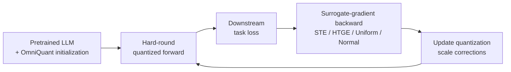

# [Rethinking Gradient Approximation in Quantization: A Zeroth-Order Expectation Perspective](https://openreview.net/forum?id=0ZZ3tyBGyc)

[English](README.md) | [中文](README_zh.md)

We propose **ZOE-Grad (Zeroth-Order Expectation Gradient)**, a boundary-aware surrogate-gradient framework for LLM quantization from a zeroth-order expectation perspective. ZOE-Grad establishes constructive mappings between perturbation distributions and boundary-dependent surrogate gradients, characterizes STE as a special case induced by fixed-magnitude Rademacher perturbations, and provides bounded-error convergence guarantees for the original quantized objective.

This repository provides the implementation used for downstream fine-tuning experiments on OPT, LLaMA-2, and Qwen3. The current unified scripts support **STE, HTGE, Uniform, and Normal** surrogate gradients across eight downstream tasks.

## Method Overview



The forward pass retains hard rounding, while the selected surrogate gradient is used only during backpropagation. Model weights remain frozen and the downstream supervision updates the quantization-scale corrections. The surrogate computation therefore introduces no additional inference-time cost.

## Install

```bash
conda create -n ZOE python=3.10.19 -y
conda activate ZOE
python -m pip install torch==2.9.1 --index-url https://download.pytorch.org/whl/cu128
python -m pip install -r requirements.txt
```

## Required Local Files

Before starting experiments, create the following directories and place the files required by the selected model in them:

- `pre_quantized_models/` stores per-layer OmniQuant parameter checkpoints. During quantization, `scripts/run.sh` loads the selected model's `*-w4a16.pth` file before downstream training.
- `act_scales/` and `act_shifts/` store activation statistics. The default script enables Learnable Equivalent Transformation (LET) for OPT-1.3B and OPT-6.7B and loads the corresponding `.pt` files. LET is disabled by default for LLaMA-2-7B, LLaMA-2-13B, and Qwen3-8B.

OmniQuant parameter checkpoints and activation statistics can be obtained from [OmniQuant](https://github.com/OpenGVLab/OmniQuant); model files unavailable there must first be trained independently.

## Usage

Run the following commands from the repository root:

```bash
CUDA_VISIBLE_DEVICES=0 scripts/run.sh opt-1.3b SST2 STE
CUDA_VISIBLE_DEVICES=0 scripts/run.sh llama2-7b SQuAD Normal
CUDA_VISIBLE_DEVICES=0 scripts/run.sh qwen3-8b WSC HTGE
```

Supported model aliases are `opt-1.3b`, `opt-6.7b`, `llama2-7b`, `llama2-13b`, and `qwen3-8b`. Each model can be paired with any of the following tasks and surrogate-gradient methods:

- **Classification:** SST2, RTE, CB, BoolQ, WSC, WIC, MultiRC
- **Question answering:** SQuAD
- **Surrogate gradients:** STE, HTGE, Uniform, Normal

Classification tasks score candidate answers by their model probabilities. SQuAD uses teacher-forced loss on answer tokens for training and F1 on generated answers for evaluation. The default quantization configuration is W4A16, and all tasks use WikiText2 data for quantization calibration.

`scripts/run.sh` accepts environment variables to override common settings; additional `train_main.py` options can be placed after the three required arguments:

```bash
CUDA_VISIBLE_DEVICES=0 STEPS=256 LR=1e-6 NUM_TRAIN=64 scripts/run.sh qwen3-8b RTE Uniform --no_eval true
DRY_RUN=1 scripts/run.sh opt-6.7b SQuAD Normal
```

The first command trains Qwen3-8B on RTE using the Uniform surrogate. The assignments before `scripts/run.sh` apply only to this invocation:

- `CUDA_VISIBLE_DEVICES=0` makes GPU 0 available to the process.
- `STEPS=256` sets the maximum number of training steps to 256 instead of the default 5,000.
- `LR=1e-6` sets the learning rate to 0.000001.
- `NUM_TRAIN=64` selects 64 training examples.

The trailing `--no_eval true` is passed to `train_main.py` and skips evaluation after training.

The second command runs OPT-6.7B on SQuAD with the Normal surrogate. With `DRY_RUN=1`, the script prints the resulting `python train_main.py ...` command without loading a model or starting training. It still checks that the required OmniQuant parameter checkpoint exists.

Supported environment variables include `STEPS`, `LR`, `BATCH_SIZE`, `WBITS`, `ABITS`, `RESUME_PATH`, `NUM_TRAIN`, `NUM_EVAL`, `NUM_DEV`, `DELTA_OVERRIDE`, `T`, `OUTPUT_DIR`, and `HF_HOME`.

To inspect all supported model-task-surrogate combinations without training:

```bash
DRY_RUN=1 scripts/run_matrix.sh
```

To run the matrix sequentially:

```bash
CUDA_VISIBLE_DEVICES=0 scripts/run_matrix.sh
```

## Results

For SST-2, RTE, CB, BoolQ, WSC, WiC, and MultiRC, we report accuracy (%). For SQuAD, we report F1.

### W4A16 Weight-Only Quantization

**Table 1 (selected models).** Performance comparison of 4-bit weight-only quantization with different surrogate gradients on downstream tasks.

| Model | Method | SST-2 | RTE | CB | BoolQ | WSC | WiC | MultiRC | SQuAD |
| --- | --- | ---: | ---: | ---: | ---: | ---: | ---: | ---: | ---: |
| LLaMA-2-7B | Zero-Shot | 58.03 | 62.09 | 33.93 | 66.10 | 36.54 | 50.16 | 42.40 | 58.71 |
|  | Zero-Shot-Q | 50.92 | 48.38 | 50.00 | 39.90 | 53.85 | 50.00 | 58.80 | 41.80 |
|  | STE | 93.46 | 58.12 | 57.14 | 60.70 | 63.46 | 51.84 | 59.40 | 47.33 |
|  | HTGE | **95.18** | 66.06 | **73.21** | 67.80 | **73.08** | **68.81** | 59.60 | 61.73 |
|  | Uniform | 94.72 | **69.70** | 69.64 | 62.30 | 64.42 | 54.67 | **62.60** | **66.69** |
|  | Normal | 94.15 | 67.54 | **73.21** | **69.60** | 65.38 | 53.76 | 60.70 | 66.15 |
| OPT-6.7B | Zero-Shot | 61.24 | 54.87 | 53.57 | 57.30 | 37.50 | 51.25 | 41.70 | 40.37 |
|  | Zero-Shot-Q | 56.88 | 52.71 | 35.71 | 45.10 | 36.54 | 53.76 | 41.40 | 29.70 |
|  | STE | 93.46 | 62.09 | 69.64 | 60.10 | 60.52 | 55.46 | 58.40 | 41.55 |
|  | HTGE | 94.72 | **70.76** | 76.79 | 61.30 | **64.42** | 57.83 | 60.30 | **54.79** |
|  | Uniform | **94.95** | 67.15 | 78.57 | **73.80** | **64.42** | **61.29** | **60.80** | 54.40 |
|  | Normal | 94.72 | **70.76** | **85.71** | 72.80 | 63.46 | 59.25 | 60.40 | 54.38 |
| Qwen3-8B | Zero-Shot | 55.50 | 84.48 | 66.07 | 80.20 | 64.42 | 63.01 | 85.50 | 34.50 |
|  | Zero-Shot-Q | 57.57 | 83.03 | 44.64 | 78.20 | 62.50 | 59.25 | 82.90 | 30.18 |
|  | STE | 87.96 | 83.39 | 73.21 | 81.80 | 72.12 | 70.38 | 83.40 | 56.88 |
|  | HTGE | 89.91 | 86.64 | 82.14 | **85.60** | 75.00 | 72.57 | 84.60 | 65.18 |
|  | Uniform | **92.89** | 88.81 | **89.29** | 85.40 | **76.92** | **73.98** | 87.20 | **70.29** |
|  | Normal | 91.17 | **90.25** | 82.14 | 85.10 | 72.12 | 71.00 | **88.60** | 64.21 |

**Table 8.** Performance comparison of 4-bit weight-only quantization with 16-bit activations using different surrogate gradients on LLaMA-2-13B.

| Model | Method | SST-2 | RTE | CB | BoolQ | WSC | WiC | MultiRC | SQuAD |
| --- | --- | ---: | ---: | ---: | ---: | ---: | ---: | ---: | ---: |
| LLaMA-2-13B | Zero-Shot | 61.12 | 50.90 | 48.21 | 73.20 | 39.42 | 50.47 | 46.10 | 64.52 |
|  | Zero-Shot-Q | 58.03 | 45.13 | 53.57 | 70.90 | 45.19 | 50.31 | 46.10 | 55.62 |
|  | STE | 89.45 | 59.21 | 71.43 | 73.60 | 63.46 | 63.17 | 70.40 | 53.55 |
|  | HTGE | **91.74** | 77.98 | 73.21 | 82.10 | 71.15 | **68.81** | **81.60** | **63.88** |
|  | Uniform | 90.14 | 77.26 | **82.14** | **83.20** | 70.19 | 68.34 | 79.10 | 60.60 |
|  | Normal | 90.83 | **80.87** | 78.57 | 81.80 | **72.12** | 68.50 | 80.10 | 61.61 |

### W4A4KV4 Quantization and Rotation

**Table 3.** W4A4KV4 results on Qwen2.5-0.5B without rotation.

| Method | R-1 | R-2 | R-L | R-LSum | Average |
| --- | ---: | ---: | ---: | ---: | ---: |
| STE | 28.86 | 9.15 | 22.52 | 22.51 | 20.76 |
| Uniform | 30.33 | 10.18 | 23.72 | 23.73 | **21.99** |
| Normal | 30.32 | 10.00 | 23.56 | 23.57 | 21.86 |

**Table 4.** W4A4KV4 results on Qwen2.5-0.5B with rotation.

| Method | R-1 | R-2 | R-L | R-LSum | Average |
| --- | ---: | ---: | ---: | ---: | ---: |
| RoSTE | 29.50 | 9.60 | 22.74 | 22.75 | 21.15 |
| RoUniform | 31.87 | 11.30 | 24.98 | 24.98 | **23.28** |
| RoNormal | 31.27 | 10.59 | 23.87 | 23.88 | 22.40 |

## Acknowledgments

The quantization initialization and model integration build on [OmniQuant](https://github.com/OpenGVLab/OmniQuant). Training and model loading use [Hugging Face Transformers](https://github.com/huggingface/transformers) and [Accelerate](https://github.com/huggingface/accelerate). We thank the upstream authors and contributors.
