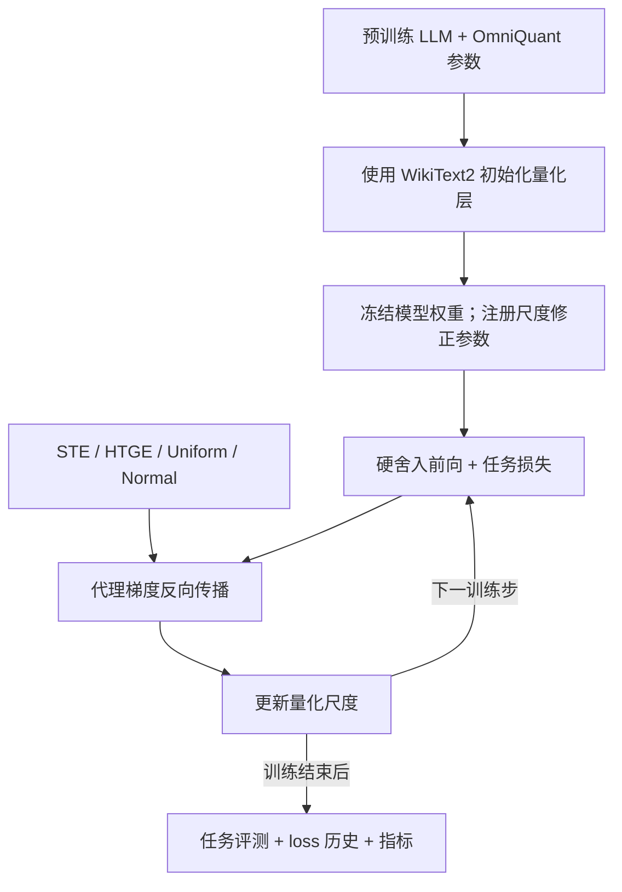

# ZOE-Grad：面向 LLM 量化的边界感知代理梯度

[English](README.md) | [中文](README_zh.md)

**NeurIPS 2026 · 已接收**

> **Rethinking Gradient Approximation in Quantization: A Zeroth-Order Expectation Perspective**

ZOE-Grad 将零阶梯度估计的期望与边界感知代理梯度联系起来，用于低比特大语言模型量化。本仓库将这些梯度实现为 PyTorch 反向传播算子，并提供覆盖 OPT、Llama-2 和 Qwen3 的统一训练评测流程，在**冻结模型权重的条件下微调量化尺度**。

**论文代表性结果：**在 Qwen3-8B 的 W4A16 量化设置下，相比 STE，Uniform 将 SQuAD F1 从 **56.88 提升至 70.29（+13.41 点）**。

[方法概览](#方法概览) · [核心结果](#核心结果) · [支持范围](#支持的模型任务与梯度估计器) · [快速开始](#快速开始) · [源码导航](#源码导航) · [详细使用说明](#运行说明)

## 为什么需要 ZOE-Grad？

低比特量化中的舍入操作几乎处处导数为零，使量化参数难以直接优化。常用的直通估计器（STE）以常数近似反向梯度，忽略了输入相对于量化边界的位置。

ZOE-Grad 从零阶梯度估计的期望出发推导代理梯度。扰动分布决定反向梯度如何响应附近的量化边界，从而为代理梯度的设计和比较提供理论依据。论文还将 STE 解释为固定幅度 Rademacher 扰动所诱导的期望。

## 核心亮点

- **从理论构造到训练算子。**建立扰动分布与边界依赖代理梯度之间的双向构造关系，在 [`quantize/quantizer.py`](quantize/quantizer.py) 中实现 STE、HTGE、Uniform 和 Normal。
- **自定义 PyTorch 反向传播。**前向保留硬舍入，反向使用所选代理梯度的解析表达式；Uniform 和 Normal 支持单边界与多边界形式。
- **量化尺度优化。**以 OmniQuant 参数为初始化，利用下游监督信号更新尺度修正参数（`descale`），模型权重保持冻结；有效尺度为 `scale + descale`。
- **LLM 训练与评测。**通过面向不同架构的量化层适配 OPT、Llama-2 和 Qwen3，包括 Qwen3 attention 集成；分类与问答任务采用各自的损失函数和评测指标。
- **实验编排与可检查输出。**统一模型、任务和方法接口，支持 5 × 8 × 4 配置矩阵、dry run、带种子的数据采样、loss 历史、loss 曲线和指标 JSON 文件。

## 核心结果

以下为**论文表 1 中选取的结果**，比较 W4A16 量化下的 Uniform 与 STE。W4A16 表示权重为 4 位、激活为 16 位。

| 模型 | 任务 / 指标 | STE | Uniform | 绝对提升 |
| --- | --- | ---: | ---: | ---: |
| Qwen3-8B | SQuAD F1 | 56.88 | **70.29** | **+13.41 点** |
| Qwen3-8B | RTE 准确率（%） | 83.39 | **88.81** | **+5.42 个百分点** |
| Llama-2-7B | SQuAD F1 | 47.33 | **66.69** | **+19.36 点** |

这些结果展示了跨模型架构以及分类、生成两类任务上的收益。最佳估计器随模型和任务变化；该表是论文结果选摘，不代表所有任务的平均收益，也不是本次新增的复现实测。

**论文扩展实验。**论文还评估了 Llama-2-7B 的 W3A16、OPT-6.7B 的 W2A16，以及 Qwen2.5-0.5B 在带旋转和不带旋转时的 W4A4KV4 设置。在带旋转设置下，RoUniform 的平均 ROUGE 为 **23.28**，RoSTE 为 **21.15**（**+2.13 点**，表 4）。Qwen2.5 与旋转实验属于论文结果；当前统一脚本覆盖下表列出的五个模型。

## 方法概览

每次运行加载预训练 LLM，使用 WikiText2 校准输入和外部 OmniQuant 参数初始化量化层，再在下游任务上微调量化尺度。



零阶期望用于构造**解析反向梯度公式**。训练使用 autograd 和 Hugging Face Trainer；代理梯度在反向传播阶段计算，推理时不增加代理梯度计算。

本实现使用 PyTorch 伪量化（fake quantization）和浮点线性运算研究量化优化，不提供打包的 INT4 推理内核。

## 支持的模型、任务与梯度估计器

| 类别 | 当前统一脚本支持范围 |
| --- | --- |
| 模型 | OPT-1.3B、OPT-6.7B、Llama-2-7B、Llama-2-13B、Qwen3-8B |
| 分类任务 | SST2（SST-2）、RTE、CB、BoolQ、WSC、WIC（WiC）、MultiRC |
| 生成任务 | SQuAD |
| 梯度估计器 | STE、HTGE、Uniform、Normal |
| 默认量化配置 | W4A16，使用外部 OmniQuant 参数初始化 |
| 可训练参数 | 量化尺度修正参数（`descale`）；模型权重保持冻结 |
| 校准数据 | WikiText2 |
| 主要依赖 | Python、PyTorch、Transformers、Accelerate、datasets、Matplotlib |

五个模型别名均可与八个任务、四种估计器组合。**160 种组合表示脚本支持的配置范围**，不表示仓库已完成全部组合的复现。

## 源码导航

| 阅读入口 | 主要内容 |
| --- | --- |
| [`quantize/quantizer.py`](quantize/quantizer.py) | 硬舍入前向、自定义代理梯度反向传播及有效量化尺度 |
| [`train_main.py`](train_main.py) | 参数冻结、任务训练、评测与指标输出 |
| [`quantize/omniquant.py`](quantize/omniquant.py) | OmniQuant 初始化及不同模型架构的量化层构造 |
| [`models/int_qwen3_layer.py`](models/int_qwen3_layer.py) | Qwen3 attention 与 MLP 集成，包括 Q/K normalization、RoPE 和 KV cache 处理 |
| [`scripts/run.sh`](scripts/run.sh) / [`scripts/run_matrix.sh`](scripts/run_matrix.sh) | 单实验配置与矩阵串行执行 |

其他模块包括：[`tasks.py`](tasks.py) 和 [`templates.py`](templates.py) 负责任务数据与提示模板；[`utils.py`](utils.py) 提供任务损失与工具函数；[`metrics.py`](metrics.py) 负责评测；[`trainer.py`](trainer.py) 负责 loss 记录。

## 快速开始

在 Linux 或 WSL 上使用 Bash，准备 NVIDIA GPU 及所需模型的访问权限。运行前需准备所选模型的 OmniQuant 参数 checkpoint；OPT 在默认 LET 配置下还需要激活统计文件。完整要求见[所需本地文件](#所需本地文件)。

1. 安装[运行环境](#运行环境)。
2. 准备[所需本地文件](#所需本地文件)。
3. 在相同模型和任务上分别运行 ZOE-Grad 估计器与 STE 基线：

```bash
# Uniform surrogate
CUDA_VISIBLE_DEVICES=0 scripts/run.sh qwen3-8b RTE Uniform

# STE baseline
CUDA_VISIBLE_DEVICES=0 scripts/run.sh qwen3-8b RTE STE
```

这些命令使用脚本默认值，属于使用示例。复现论文表格需采用对应模型、任务和方法的实验设置，包括学习率、batch size、扰动参数及评测样本数。

## 运行环境

```bash
conda create -n ZOE python=3.10.19 -y
conda activate ZOE
python -m pip install torch==2.9.1 --index-url https://download.pytorch.org/whl/cu128
python -m pip install -r requirements.txt
```

## 运行说明

从仓库根目录运行以下命令：

```bash
CUDA_VISIBLE_DEVICES=0 scripts/run.sh opt-1.3b SST2 STE
CUDA_VISIBLE_DEVICES=0 scripts/run.sh llama2-7b SQuAD Normal
CUDA_VISIBLE_DEVICES=0 scripts/run.sh qwen3-8b WSC HTGE
```

支持的模型别名为 `opt-1.3b`、`opt-6.7b`、`llama2-7b`、`llama2-13b` 和 `qwen3-8b`。每个模型均可与前述八个任务、四种估计器中的任意组合配对。分类任务根据模型对候选答案给出的概率评分；SQuAD 在训练时使用答案 token 的 teacher-forced loss，在评测时对生成答案计算 F1。

默认量化配置为 W4A16。每次运行从 `pre_quantized_models/` 中相应文件加载初始量化参数。所有任务均使用 WikiText2 数据进行量化校准。

`run.sh` 支持通过环境变量覆盖常用配置，也可在三个必需参数后追加 `train_main.py` 的其他选项：

```bash
CUDA_VISIBLE_DEVICES=0 STEPS=256 LR=1e-6 NUM_TRAIN=64 scripts/run.sh qwen3-8b RTE Uniform --no_eval true
DRY_RUN=1 scripts/run.sh opt-6.7b SQuAD Normal
```

第一条命令在 RTE 上使用 Uniform 梯度估计器训练 Qwen3 8B。`scripts/run.sh` 前的环境变量赋值仅对本次调用生效：

- `CUDA_VISIBLE_DEVICES=0`：使进程可使用 GPU 0。
- `STEPS=256`：将最大训练步数设为 256，而非默认的 5,000。
- `LR=1e-6`：将学习率设为 0.000001。
- `NUM_TRAIN=64`：选择 64 条训练样本。

末尾的 `--no_eval true` 会传给 `train_main.py`，跳过训练结束后的评测。

第二条命令选择 OPT 6.7B、SQuAD 和 Normal 梯度估计器。设置 `DRY_RUN=1` 时，脚本只打印生成的 `python train_main.py ...` 命令，不加载模型或开始训练，但仍会检查所需 OmniQuant 参数 checkpoint 是否存在。命令前的环境变量赋值不会保留在 shell 中，也不会影响后续命令。

支持的环境变量包括 `STEPS`、`LR`、`BATCH_SIZE`、`WBITS`、`ABITS`、`RESUME_PATH`、`NUM_TRAIN`、`NUM_EVAL`、`NUM_DEV`、`DELTA_OVERRIDE`、`T`、`OUTPUT_DIR` 和 `HF_HOME`。

`DRY_RUN=1 scripts/run_matrix.sh` 会打印全部 5 × 8 × 4 = 160 种模型、任务和估计器组合，不执行训练。使用 `CUDA_VISIBLE_DEVICES=0 scripts/run_matrix.sh` 可按顺序运行这些组合。

## 所需本地文件

开始实验前，创建下述三个目录，并放入所选模型需要的文件。缺少必需的 OmniQuant 参数 checkpoint 会导致运行报错；默认启用 LET 的 OPT 实验若缺少激活统计文件，也会报错。

- `pre_quantized_models/`：保存逐层 OmniQuant 参数 checkpoint。量化过程中，`scripts/run.sh` 会在下游训练前加载所选模型的 `*-w4a16.pth` 文件。
- `act_scales/` 和 `act_shifts/`：保存激活统计文件。默认脚本为 OPT 1.3B 和 6.7B 启用可学习等价变换（LET），并加载对应 `.pt` 文件；Llama-2 7B、13B 和 Qwen3 8B 默认关闭 LET，因此不读取这两个目录。所有任务均使用 WikiText2 校准数据。

OmniQuant 参数 checkpoint 和激活统计文件可从 [OmniQuant](https://github.com/OpenGVLab/OmniQuant) 获取；其中未提供的模型文件需要先自行训练得到。

## 输出与复现说明

默认运行产物写入 `./logs/<model-alias>/<task>/<method>/`：

- `loss_history.json`：保存已记录的训练 loss，以及任何已记录的评测 loss。
- `loss_curve.png`：在已有训练 loss 记录时绘制训练曲线。
- 评测指标文件写在该目录**旁边**；第一组采样训练集默认使用 `<output_dir>-trainset0.json`，也可通过 `--result_file` 覆盖。例如，Qwen3/RTE/Uniform 运行会写入 `./logs/qwen3-8b/RTE/Uniform-trainset0.json`。

开启训练后评测时才会生成评测指标。默认脚本通过 `--save_strategy no` 关闭周期性 checkpoint 保存。

比较估计器或复现论文结果时，应对齐以下设置：

| 设置 | 脚本行为 / 要求 |
| --- | --- |
| 训练默认值 | `STEPS=5000`、`LR=1e-6`、`BATCH_SIZE=1`、`NUM_TRAIN=1000`、`NUM_DEV=50`；论文配置可能不同 |
| 评测样本数 | SQuAD 默认 `NUM_EVAL=300`，分类任务默认 `NUM_EVAL=1000`；论文描述的 SQuAD 评测最多使用 1,000 条样本，需显式设置 `NUM_EVAL` 以匹配对应实验 |
| 评测划分与采样 | 当前代码在任务 `valid` 划分上采样评测；比较时应记录样本数和种子 |
| 量化初始化 | 使用与模型、位宽匹配的 OmniQuant checkpoint；覆盖 `WBITS` 或 `ABITS` 不会改变默认 `*-w4a16.pth` 文件名，应通过 `RESUME_PATH` 指定匹配文件 |
| 激活量化 | 默认下游流程启用权重量化，并关闭 `QuantLinear` 的输入激活量化；仅修改 `ABITS` 无法复现论文中的权重、激活和 KV 联合量化实验 |
| 矩阵执行 | `run_matrix.sh` 枚举配置并串行执行，不会自动选择论文各实验所需的超参数 |

## 致谢

量化初始化与模型集成基于 [OmniQuant](https://github.com/OpenGVLab/OmniQuant)。训练与模型加载使用 [Hugging Face Transformers](https://github.com/huggingface/transformers) 和 [Accelerate](https://github.com/huggingface/accelerate)。感谢上游作者与贡献者。
